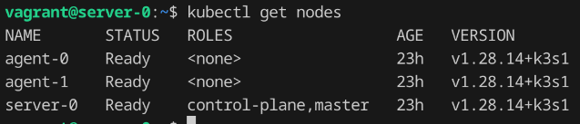

# 🔧 Challenge: Provisioning Kubernetes Cluster with Infrastructure as Code


## Scopo e Descrizione della Soluzione

Questa soluzione automatizza il provisioning completo di un cluster Kubernetes (K3s) con l'obiettivo di:

- Eseguire il deploy di un'applicazione Helm-based con interfaccia grafica (Grafana)
- Monitorare il cluster tramite Prometheus, Alertmanager e node-exporter
- Garantire accesso ai servizi da browser
- Eseguire i provisioning tramite strumenti Infrastructure as Code (IaC)
- Integrare una pipeline CI con validazioni di qualità sul codice

Il tutto viene eseguito su macchine virtuali gestite tramite Ansible e Terraform, offrendo una base solida, modulare e facilmente riutilizzabile.

---
  

## ⚙️ Stack Tecnologico

- **Terraform** – Provisioning delle risorse (VM + Kubernetes)
- **Ansible** – Configurazione delle Virtual Machines
- **Kubernetes** – Cluster container-orchestration
- **Helm** – Deploy di un'applicazione multi-servizio
- **CI/CD** – Pipeline GitHub Actions per linting
- **Tool provisioning VM** – es: Vagrant + Libvirt e QEMU
- **Benchmark sicurezza** – es: kube-bench


## ⚙️ Scelte Tecniche

| Componente         | Scelta                   | Motivazione                                                                 |
|--------------------|--------------------------|------------------------------------------------------------------------------|
| VM provisioning    | **Vagrant + Ansible**    | Semplicità di uso e compatibilità su ambienti locali                       |
| Cluster K8s        | **K3s**                  | Lightweight, ideale per test e ambienti locali                              |
| Monitoring Stack   | **kube-prometheus-stack**| Helm chart completo e modulare, con supporto CRD, dashboards e alerting     |
| IaC Tooling        | **Terraform**            | Per gestire risorse cluster (namespace, Helm release, ecc.)                 |
| Benchmark Sicurezza| `kube-bench`             | Per verifica contro le linee guida CIS                                      |
| CI Pipeline        | GitHub Actions           | Integrazione semplice per linting Terraform, Ansible e Helm                |

---


## 🏗️ Architettura della Soluzione


## 🛠️ Setup del progetto

### 📁 Struttura del Repository  

```

├── terraform/ # Provisioning cluster e VM

├── k3s0ansible/ # Configurazione nodi K3s e relativi playbooks

├── helm/ # Chart Helm per l'applicazione

├── .github/workflows/ # Pipeline CI

├── benchmarks/ # Output benchmark sicurezza

└── README.md # Documentazione

```

### 1. Clonare il repository

```bash

git clone https://github.com/tuo-utente/kiratech-challenge.git

cd kiratech-challenge

```

### 2 Setup della rete

ll progetto utilizza la rete **`default`** di libvirt per connettere le VM tra loro.
Questa rete è generalmente predefinita e disponibile su tutte le installazioni libvirt.  
⚠️ **Assicurati che sia attiva prima di eseguire il provisioning:**

```bash
virsh net-list --all
virsh net-start default      # Se non è già attiva
```

E se non esiste, puoi ricrearla con:
```bash
sudo virsh net-define libvirt-network/default.xml
sudo virsh net-autostart default
sudo virsh net-start default
```
### 3. Avvio VM tramite Vagrant e configurazione 3ks con Ansible

```bash
cd k3s-ansible
vagrant up
```

#### Modifiche al Vagrantfile
l Vagrantfile originale è stato modificato per adattare la topologia del cluster e la configurazione di rete al progetto corrente.

| Sezione          | Valore Originale                                             | Valore Modificato                           | Motivo                                    |
| ---------------- | ------------------------------------------------------------ | ------------------------------------------- | ----------------------------------------- |
| `NODE_ROLES`     | `["server-0", "server-1", "server-2", "agent-0", "agent-1"]` | `["server-0", "agent-0", "agent-1"]`        | Cluster più leggero (1 master + 2 worker) |
| `NODE_BOXES`     | 5 voci `['bento/ubuntu-24.04', ...]`                         | 3 voci, una per ciascun nodo definito       | Ridotto per riflettere la nuova topologia |
| `NETWORK_PREFIX` | `"10.10.10"`                                                 | `"192.168.122"`                             | Allineato alla rete `default` di libvirt  |
| `vm.network`     | `private_network`, IP e netmask                              | Aggiunto `libvirt__network_name: "default"` | Forza uso rete `default` libvirt          |


#### Modifiche al file inventory.yml

Il file inventory.yml è stato modificato rispetto alla versione originale del progetto per adattarsi all’ambiente locale creato con Vagrant e libvirt.
Differenze principali:
| Sezione           | Originale                      | Modificata                           | Motivo                                     |
| ----------------- | ------------------------------ | ------------------------------------ | ------------------------------------------ |
| **IP server**     | `192.16.35.11`                 | `192.168.122.100`                    | Allineato alla rete `libvirt` (`default`)  |
| **IP agent**      | `192.16.35.12`, `192.16.35.13` | `192.168.122.101`, `192.168.122.102` | Idem come sopra                            |
| **ansible\_user** | `debian`                       | `vagrant`                            | Utente predefinito nelle VM Vagrant        |
| **k3s\_version**  | *(assente)*                    | `v1.30.2+k3s1`                       | Versione K3s desiderata esplicitamente     |
| **k3s\_become**   | *(assente)*                    | `true`                               | Richiesto per eseguire `k3s` con privilegi |


|Ruolo|Hostname|Indirizzo IP|
|---|---|---|
|**Master**|`server-0`|`192.168.122.100`|
|**Worker**|`agent-0`|`192.168.122.101`|
|**Worker**|`agent-1`|`192.168.122.102`|

### 4. Verifica del Cluster Kubernetes

Puoi connetterti alla VM master ed eseguire:
```bash
vagrant ssh server-0
kubectl get nodes
```




### 5. Setup Terraform per Kubernetes

```bash
# Estrai il kubeconfig dal nodo master
sudo vagrant ssh server-0 -c 'sudo cat /etc/rancher/k3s/k3s.yaml' | sudo tee ../terraform/kubeconfig.yaml > /dev/null


# Sostituisci l'indirizzo 127.0.0.1 con l'IP privato del master (es. 192.168.122.100)
sed -i 's/127.0.0.1/192.168.122.100/g' ../terraform/kubeconfig.yaml
```

### 6. Definizione del namespace, Run del kube-bench job  e dell'helm chart sul cluster

```bash
terraform init
terraform plan
terraform apply
```

#### Modifiche al file values.yaml di kube-prometheus-stack
Alcune sezioni del file values.yaml sono state personalizzate per:

    Esporre Grafana via NodePort
    Garantire aggiornamenti in rolling update senza downtime

| Sezione            | Valore Originale | Valore Modificato                                    | Motivo                                        |
| ------------------ | ---------------- | ---------------------------------------------------- | --------------------------------------------- |
| `service.type`     | *(non definito)* | `NodePort`                                           | Permette accesso diretto a Grafana da browser |
| `service.nodePort` | *(non definito)* | `30080`                                              | Espone Grafana su `http://<ip-node>:30080`    |
| `strategy`         | `{}` *(vuoto)*   | `RollingUpdate` con `maxSurge=1`, `maxUnavailable=1` | Abilita rollout senza downtime                |


## 🧪 Benchmark di Sicurezza

Il benchmark è stato eseguito tramite `kube-bench`.
I Log e report sono disponibili in: `./benchmarks/kube-bench-<data>.log`

  
### 🌐 Accesso ai Servizi di Monitoraggio

| Servizio | Metodo di Accesso | URL di Accesso da Browser                                    | Note                        |
| -------- | ----------------- | ------------------------------------------------------------ | --------------------------- |
| Grafana  | NodePort          | [http://192.168.122.100:30080](http://192.168.122.100:30080) | Accesso diretto via browser |

Le credenziali per l'accesso a grafana:
- adminUser: admin
- adminPassword: prom-operator


## Rolling Update dell’Applicazione

L’applicazione è deployata tramite Helm con aggiornamenti in modalità rolling, per garantire l’alta disponibilità e ridurre al minimo il downtime durante i rilasci.

E' stato modificato il file values.yml del chart kube-proetheus-stack

```yaml
  ## Strategy of the deployment
  strategy:
    type: RollingUpdate
    rollingUpdate:
      maxSurge: 1
      maxUnavailable: 1
```


## 🧪 Pipeline CI (GitHub Actions)
  
Ogni push su `main` e ogni PR attiva:
- ✅ Linting Terraform (`terraform fmt e tf-lint`)
- ✅ Linting Ansible (`ansible-lint`)
- ✅ Linting Helm chart (`helm lint`)

File: `.github/workflows/lint.yml`


---
  

## 🧩 Moduli e codice riutilizzato

- Chart Helm di base riadattato da: https://github.com/prometheus-community/helm-charts/tree/main/charts/kube-prometheus-stack
- Codice ansible per il deploy di 3ks e vagrant file: https://github.com/k3s-io/k3s-ansible
  

---
  

## ✅ Cosa funziona

  

- Cluster Kubernetes (1 master + 2 worker)

- Deploy app Helm-based accessibile via browser

- Namespace `kiratech-test`

- Rolling update

- Benchmark sicurezza eseguito

- CI funzionante  


---